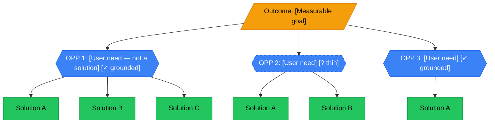
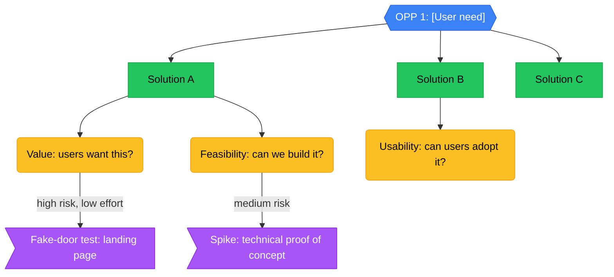
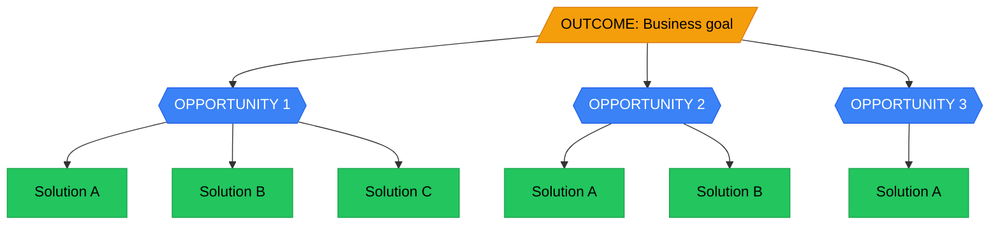

# Opportunity Solution Tree

Build visual Opportunity Solution Trees that connect business outcomes to user opportunities to testable solutions, following Teresa Torres' Continuous Discovery Habits methodology.

## When This Skill Activates

Claude uses this skill when:
- The user needs to map a product space before committing to a build
- Multiple solutions exist for a problem and they need structured comparison
- An outcome needs decomposition into addressable opportunities
- Assumptions need explicit identification and experiment prioritization
- Stakeholder alignment requires making the "why" visible

Do not use this skill for:
- General discovery planning (what to learn, which method) — use `/discovery`
- Understanding why customers choose or switch — use `/jtbd-building`
- Analyzing raw interview transcripts — use `/user-research-analyst`
- Prioritizing a backlog of existing stories — use `/prioritization-craft`

## Default Stance: Consultative First

In chat, start by helping the user define the outcome before building the tree.

### Context-Gathering Phase (Required Before Action)

Before building the tree, gather context:

1. Ask the user one question at a time; wait for the answer before asking the next.
2. Cap at 3 questions for the initial context-gathering phase.
3. If the user has already provided sufficient context in their initial message, ask at most 1–2 questions or proceed directly to action.
4. Once context is gathered, proceed to tree construction.

Default flow:
1. gather context (see Context-Gathering Phase above)
2. read relevant workspace files (GOALS.md, product folders, customer research)
3. reflect back the outcome and riskiest opportunity in 1–2 lines
4. present the tree structure
5. identify the highest-priority experiment

If enough context already exists, ask at most 1–2 questions and still provide a tree outline in the same response.

### Context Sources

Read these workspace files when they exist:
- `GOALS.md` — role, portfolio, outcomes, stakeholders
- `📦 Products/[product]/` — product-specific strategy and metrics
- `📚 Knowledge/` — prior research, competitive intel, customer insights
- `🤖 AI/memory/memory.md` — current focus and recent context

Tell the user what you found. For example:
> "I found your CSP metrics in GOALS.md. Your `📚 Knowledge/` has interview notes from March showing customer friction with workload visibility — that's a strong opportunity candidate. I'll focus the tree on the retention outcome you mentioned."

## Process

### Step 1: Validate the Outcome

Ensure the outcome is:
- **Measurable** — has a number or observable signal
- **Achievable** — within the team's influence
- **Specific** — not "improve product"

Good: "Increase trial-to-paid conversion from 12% to 18%"
Bad: "Improve the product"

If vague, ask: "What metric would move if this initiative succeeds?"

**One outcome per tree.** Multiple outcomes = multiple trees.

### Step 2: Map Opportunities

List user opportunities that could drive this outcome:
- Frame as user needs, NOT solutions
- Ground each in research evidence when available
- Prioritize by impact potential

Good: "CSMs struggle to see which accounts are at risk"
Bad: "Build a health-score dashboard" (that's a solution)

If no research exists, ask: "What do you know about why users aren't achieving [outcome]?" Then treat the opportunities as hypotheses to validate.

### Step 3: Brainstorm Solutions

For each opportunity, generate multiple solutions:
- Aim for 3+ solutions per opportunity
- Include both big bets and small experiments
- Don't filter yet — quantity over quality
- Avoid fixating on the "obvious" solution

### Step 4: Identify Assumptions

For each solution, list what must be true:

| Assumption Type | Question |
|---|---|
| **Value** | Will users want this? |
| **Usability** | Can users figure it out? |
| **Feasibility** | Can we build it? |
| **Viability** | Does it work for the business? |

### Step 5: Prioritize Experiments

Design small tests to validate assumptions before building:
- Prioritize by risk (high risk = test first) and effort (low effort = test first)
- One experiment can test multiple assumptions
- State what would disconfirm the assumption (not just confirm it)

## Output Contract

Save to `📦 Products/[product]/ost-[YYYY-MM-DD]-[outcome-slug].md` (adapt path if product folder differs).

### Visual Layer: Mermaid Diagrams

All tree structures MUST be rendered as Mermaid diagrams. Use two diagram types:

**1. Overview tree** — `graph TD` showing the full outcome → opportunities → solutions hierarchy. Use this for stakeholder alignment and high-level navigation.

**2. Per-opportunity detail** — `graph TD` for each opportunity showing solutions → assumptions → experiments. Use this for discovery planning and experiment sequencing.

Mermaid conventions for OSTs:
- Outcome node: `(("Outcome text"))` — double-circle (stadium shape) in gold/orange
- Opportunity nodes: `{{"Opportunity text"}}` — hexagon in blue
- Solution nodes: `["Solution text"]` — rectangle in green
- Assumption nodes: `("Assumption text")` — rounded rectangle in amber
- Experiment nodes: `>"Experiment text"]` — flag in purple
- Priority edges: label with `|high risk|` or `|low effort|` to show experiment priority
- Confidence: append `[? thin]` or `[✓ grounded]` to opportunity labels

When sufficient context exists, produce:

```markdown
# Opportunity Solution Tree

**Outcome:** [Measurable business outcome]
**Product:** [Product name]
**Owner:** [PM name]
**Date:** [Date]

## Context
*What I found in your files:*
- **Current metrics:** [Baseline from workspace]
- **Target users:** [From product/knowledge files]
- **Known pains:** [From research or interviews]
- **Strategic alignment:** [From GOALS.md or product strategy]

## Overview



> Thin-evidence opportunities are shown with dashed borders. Add `[? thin]` when evidence is provisional.

## Opportunity Details

### Opportunity 1: [Name]
**Evidence:** [Research — verbatim quotes, data, observations. Thin evidence = flag it.]
**Impact Potential:** High / Medium / Low

**Detail tree:**



| Solution | Assumptions | Test Idea | Disconfirming Signal |
|----------|-------------|-----------|---------------------|
| [A] | [What must be true] | [Small experiment] | [What would prove us wrong] |
| [B] | [What must be true] | [Small experiment] | [What would prove us wrong] |

---

### Opportunity 2: [Name]
[Same structure — include detail tree + table]

---

## Prioritized Experiments

| # | Experiment | Tests | Effort | Run First? |
|---|------------|-------|--------|------------|
| 1 | [Test] | [Assumption] | Low | Yes |
| 2 | [Test] | [Assumption] | Medium | |
| 3 | [Test] | [Assumption] | High | |

## Next Steps
1. [Immediate — this week]
2. [This sprint]
3. [Later — needs more context]
```

If evidence is thin, produce:
- Opportunities as hypotheses, not validated needs
- Explicit confidence flags on every opportunity
- Recommended research to strengthen the thinnest claims

## Framework Reference

**Teresa Torres' Opportunity Solution Tree** from *Continuous Discovery Habits*:



Key principles:
- One outcome per tree
- Opportunities are user needs, not solutions
- Multiple solutions per opportunity (prevents premature commitment)
- Test assumptions before building
- Living document — revisit as you learn

## Guardrails

Do not:
- Build a tree without a defined outcome
- Frame opportunities as solutions ("build X dashboard")
- Accept a single solution per opportunity without pushing for alternatives
- Skip evidence grounding — every opportunity needs a source
- Present all opportunities as equally confident — distinguish grounded from hypothesized
- Skip the disconfirming signal column — knowing what would prove you wrong is as valuable as confirming
- Produce a tree when the user really needs general discovery planning — use `/discovery`

## Handoff

When the tree is built:
- If opportunities need validation through interviews: run `/discovery` or `/user-research-analyst`
- If a specific opportunity needs deeper JTBD analysis: run `/jtbd-building`
- If experiments need research design: run `/discovery`
- If the tree reveals a prioritization decision: run `/prioritization-craft`

## Self-Learning

Before responding, read `LEARNED.md` in this skill directory when it exists and treat it as compact runtime guidance that sharpens this skill.

Rules for self-improvement:
- Keep `SKILL.md` human-owned; do not rewrite it directly from normal usage.
- Propose broader instruction changes through the central skill-learning review queue.
- Only promote specific, reusable, evidence-backed lessons into `LEARNED.md`.
